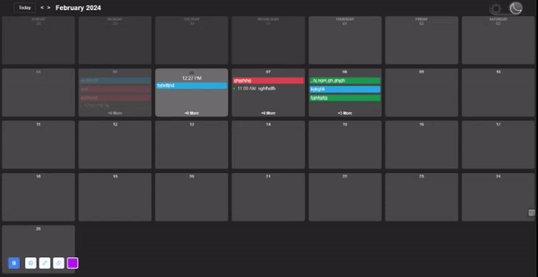

# Calendar canvas


[](https://app.netlify.com/sites/calendarcanvas/deploys)

A customizable and responsive React calendar component for managing events efficiently. This component provides intuitive navigation, real-time clock indicators, dark mode, and event management functionalities.

Check out the [demo](https://calendarcanvas.netlify.app/)!

## Features

- **Intuitive Navigation:** Easily navigate between months and switch to the current month with a single click.
- **Real-Time Clock Indicator:** View the current time dynamically updated on the calendar interface.
- **Dark Mode:** Toggle between light and dark mode for a personalized viewing experience.
- **Event Management:** Add, edit, or delete events seamlessly within the calendar interface.
- **Responsive Design:** Ensure a consistent and optimal user experience across various devices.

## Demo


Check out the [live demo](https://calendarcanvas.netlify.app/) hosted on Netlify.

## Getting Started

1. Clone the repository:

```bash
git clone https://github.com/mmnsrti/calender.git
```

2. Install dependencies:

```bash
npm install
```

3. Run the application:

```bash
npm start
```

4. Access the application at `http://localhost:3000` in your web browser.

## Usage

1. **Navigation:**
   - Use the navigation buttons to move between months or click the "Today" button to jump to the current month.
   - The calendar highlights the current day and updates the real-time clock indicator.

2. **Event Management:**
   - Click on any day to view and manage events for that day.
   - Add new events using the "+ Add" button and edit or delete existing events as needed.

3. **Dark Mode:**
   - Toggle dark mode on or off using the provided switch for comfortable viewing in different environments.

## Contributing

Contributions are welcome! Please refer to the [CONTRIBUTING.md](CONTRIBUTING.md) file for guidelines on how to contribute to this project.

## License

This project is licensed under the [MIT License](LICENSE).

## Contact

If you have any questions or suggestions, feel free to reach out to the project maintainers:

- [mmnsrti](mmnsrti@gmail.com)

## Acknowledgments

- [date-fns](https://date-fns.org/): A JavaScript library for date manipulation.
- [Netlify](https://www.netlify.com/): Hosting the live demo of the calendar component.

---

